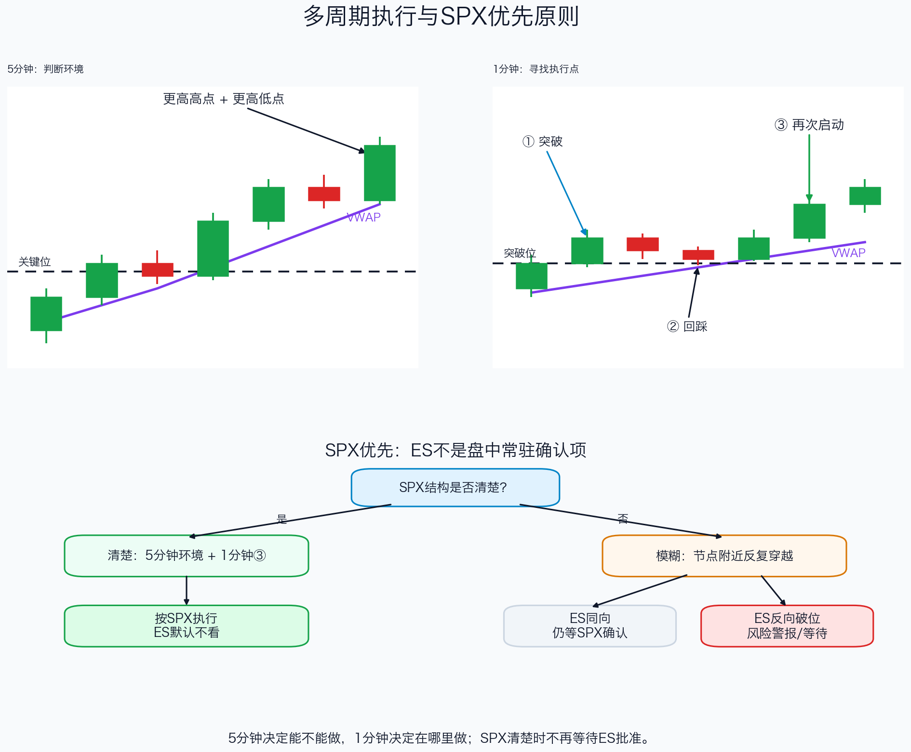

# 第五章：多周期过滤与辅助确认

> 5 分钟决定当前环境能不能做，1 分钟决定在哪里做；SPX 结构清楚时，不再等待其他市场批准。

## 一、每个周期只承担一项任务

多周期分析不是同时寻找更多信号，而是给不同周期分工：

```text
5分钟：判断趋势、震荡或失败突破
3分钟：可选的结构过渡确认
1分钟：寻找突破、回踩、③（回踩后再次启动的确认K）、止损与时间退出
```

本文中的 `③` 不是某个指标名称，而是三步价格结构的第三步：`①突破关键位 → ②回踩并守住 → ③价格重新向突破方向启动`。做多时，③通常要向上突破回踩结构的小高点；做空时，③通常要向下跌破反抽结构的小低点。

不能让 1 分钟的一根漂亮 K 线推翻 5 分钟环境，也不能等待 5 分钟图提供精确入场，否则通常已经距离失效点过远。

## 二、图解：5分钟环境与1分钟执行



*教学示意：上半部分展示 5 分钟上升结构与 1 分钟突破回踩；下半部分展示 SPX 清楚和模糊时，ES 的不同作用。图中价格为构造示例。*

完整证据链是：

```text
5分钟形成更高高点与更高低点
→ 价格主要被接受在VWAP上方
→ SPX到达预先标记的关键位
→ 1分钟完成①突破、②回踩守住、③突破回踩结构并再次启动
→ 定义回踩结构外侧的失效点
→ 检查下一目标空间后建仓
```

## 三、5分钟图先回答三个问题

### 1. 趋势环境

多头趋势通常表现为：

- 更高高点与更高低点连续出现；
- 价格主要运行在 VWAP 上方；
- 回踩不重新接受旧区间；
- 上方节点仍有足够目标空间。

空头趋势完全对称。

### 2. 震荡环境

以下表现说明环境尚未提供方向优势：

- 价格反复穿越 VWAP；
- 开盘价和区间中轴反复被收回；
- 高低点结构不连续；
- 1 分钟突破频繁失败。

震荡时中间不交易，只在区间上沿或下沿等待拒绝、失败突破或边界突破回踩。

### 3. 失败突破

价格先离开 5 分钟区间，随后快速收回，并在再次测试边界时无法恢复突破，说明原方向被否定。此时 1 分钟用于寻找反抽或回踩失败，而不是追第一根反向 K 线。

## 四、1分钟图只负责执行

当 5 分钟环境明确后，切换到 1 分钟等待：

```text
价格到达关键位
→ 实体突破或快速收回
→ 等待回踩/反抽
→ ③再次启动或失败方向确认
→ 建仓
```

1 分钟同时提供：

- 更精确的入场位置；
- 回踩低点或反抽高点；
- 结构失效位置；
- 入场后 2—4 根 K 的时间止损。

如果 1 分钟过于嘈杂，可以用 3 分钟确认结构已经改变，再回到 1 分钟寻找执行点。3 分钟是可选桥梁，不是每笔交易必须增加的条件。

## 五、大小周期冲突怎样处理

| 5分钟环境 | 1分钟信号 | 处理 |
| --- | --- | --- |
| 上升结构、VWAP上方 | 多头③ | 按主剧本评估 |
| 下降结构、VWAP下方 | 局部多头③ | 不追多，等待5分钟修复 |
| 震荡、中轴反复穿越 | 中间区域③ | 不交易，等待边界 |
| 5分钟收回关键位 | 1分钟反抽失败 | 可评估失败突破方向 |

一分钟信号可以决定入场时机，但不能单独改变五分钟环境。

## 六、VWAP是环境过滤，不是自动反转线

```text
5分钟持续在VWAP上方、回踩守住 → 多头环境加分
5分钟持续在VWAP下方、反抽不过 → 空头环境加分
反复穿越VWAP → 震荡或尚未确认
1分钟突破但仍受5分钟VWAP压制 → 信号降级
```

价格结构始终优先于 VWAP。VWAP 只能说明平均成交区域附近的接受状态，不能仅凭一次触碰决定买卖方向。

## 七、SPX优先：ES默认不看

SPX 与 ES 在正常盘中大部分时间方向高度一致。对 SPX 节点日内交易而言，ES 不是每笔交易的常驻确认项。

日常屏幕可以简化为：

```text
SPX 5分钟：环境
SPX 1分钟：执行
SPX节点、ORB、VWAP和前高低：位置与目标
ES：默认不看
```

只有以下情况才临时调用 ES：

1. 盘前需要观察隔夜结构与高低点；
2. 需要成交量或 Volume Profile；
3. SPX 在关键位附近反复穿越，信号难以判断；
4. 怀疑 SPX 突破存在明显结构背离。

真正值得关注的是结构级差异，而不是一两点偏差或一根 K 线的短暂领先：

```text
SPX创造新高
但ES没有突破自己的前高
并开始跌破更高低点
→ 结构背离，视为风险警报
```

如果 ES 与 SPX 同向，但 SPX 自己仍未完成收线或回踩，仍然要等待 SPX。ES 可以诊断，不能替 SPX 完成入场。

## 八、NQ和QQQ怎样使用

NQ/QQQ 与 SPX 的成分权重差异更大，因此比 ES 提供更多科技权重强弱信息，但同样只是辅助：

```text
SPX结构清楚 + NQ同向 → 可以延长正常目标
SPX结构清楚 + NQ稍弱但未破位 → 可缩仓或缩短目标
SPX向上、NQ明显反向破位 → 多头信号降级
NQ先动、SPX未确认 → 不追，等待SPX
```

不要求所有指数每一秒完全同步。判断的是它们是否处于相同结构状态，而不是 K 线颜色是否完全一致。

## 九、盘中执行顺序

```text
1. 先看SPX 5分钟：趋势、震荡还是失败突破？
2. 标记SPX关键位：节点、ORB、VWAP、前高低。
3. 切到SPX 1分钟：是否出现突破、回踩和③？
4. 写出结构失效和第一目标。
5. SPX清楚：直接按SPX执行，不等待ES。
6. SPX模糊：临时查看ES/NQ是否给出风险警报。
7. 辅助市场不能替代SPX确认。
```

## 十、第五章执行卡

```text
SPX 5分钟环境：
SPX相对VWAP位置：
当前关键位：
SPX 1分钟触发：
是否完成③：
结构失效：
第一目标：
SPX是否已经足够清楚：
是否真的需要查看ES/NQ：
```

## 本章总结

```text
5分钟决定能不能做
1分钟决定在哪里做
SPX决定是否执行
ES/NQ只在需要时提供确认或风险警报
```

最重要的一句话是：

> SPX 结构清楚时直接按 SPX 执行；只有 SPX 模糊时，才调用其他市场做诊断。
