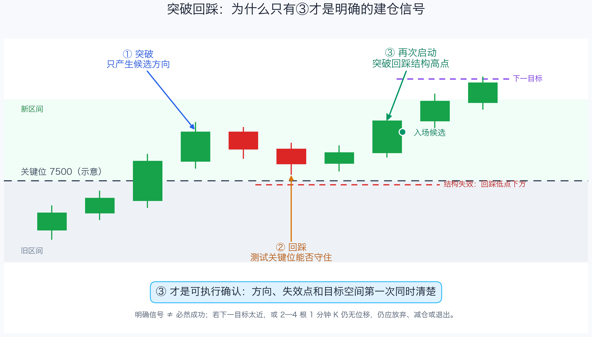
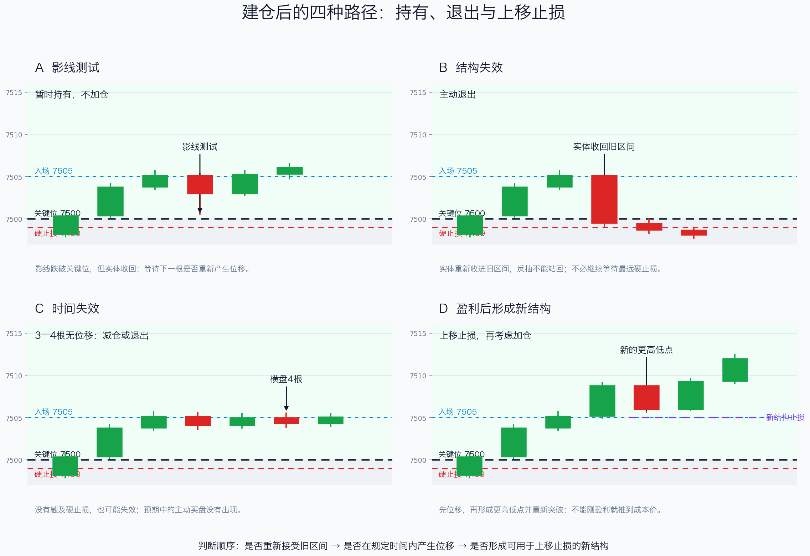

# 第六章：③、资金流与持仓管理

> 价格结构负责触发和否决，Prem/Vol 负责提供辅助证据；没有结构确认，资金流不能单独建仓。

## 一、先把③说清楚

`③`不是指标名称，也不是固定的第三根 K 线，而是三步价格结构的第三阶段：

```text
① 突破关键位
→ ② 回踩并守住
→ ③ 突破回踩结构，再次向原方向启动
```

以做多为例：

```text
关键线：7500
① 价格突破并收在 7504
② 回踩到 7501，但没有重新被接受在旧区间
③ 向上突破回踩过程的小高点，例如 7506
```



③之所以是第一个可执行确认，是因为此时可以同时写出：

- 方向：市场重新向哪一侧启动；
- 失效：做多看②的回踩低点，做空看②的反抽高点；
- 目标：下一节点、前高低或流动性区域是否还有空间。

空头完全对称：跌破支撑后反抽不过，③向下跌破反抽结构的小低点，才进入做空评估。

没有②就没有③；只有影线刺穿、没有实体收在触发位外侧，也不算清楚的③。

## 二、Prem和Vol分别说明什么

`Vol`表示成交了多少张合约，说明市场活跃程度；`Prem`表示成交金额或平台估算的权利金规模，更接近资金强度。不同平台对净权利金的统计方式可能不同，因此应把它们视为辅助估计，而不是对“新开方向性仓位”的直接证明。

```text
Vol大、Prem不明显增加 → 活跃，但方向信息有限
Prem增加、价格未确认 → 关注度增加，但不能建仓
价格确认、Prem持续同向 → 交易可信度加分
价格失效、Prem仍然很高 → 价格拥有否决权
```

资金流可能混入对冲、平仓、价差、滚仓和远虚值合约。单根巨大柱子不能替代价格结构。

## 三、资金流在三个阶段的权限

| 阶段 | 价格必须先完成的事 | Prem/Vol的作用 | 执行动作 |
| --- | --- | --- | --- |
| 建仓前 | 突破、收线、②回踩、③再次启动 | 提高关注度、辅助确认 | 没有③不建主要仓位 |
| 持仓中 | 守住②的结构极值和关键位 | 判断趋势是否仍有支持 | 结构完整可持有；加仓仍等新结构 |
| 准备退出 | 跌破失效点或反抽失败 | 提供风险背景 | 价格失效就减仓或退出 |

### 建仓前

即使 Call Prem 上升、Put Prem 下降，也要等待：

```text
突破关键线
→ 1分钟收线站稳
→ 回踩守住
→ ③再次启动
```

如果只是第一根突破 K 线，或者价格仍在关键位中间反复，资金流只能作为观察信号。

### 持仓中

一根小阴线不等于多单失效。重点看：

- 是否守住②的回踩低点；
- 回踩量能是否缩小；
- 价格是否仍在关键线或 VWAP 的有利一侧；
- Call Prem 是否保持，Put Prem 是否没有连续反向增加。

继续持有不等于立即加仓。加仓仍需要新的回踩和新的③，并且原仓止损已经能够上移或风险已经下降。

### 准备退出

如果价格已经跌破②的回踩低点，或者跌回关键线后反抽失败，即使 Call Prem 仍处于高位，也不能继续扛单。资金流可能滞后，或反映的是组合交易而非单纯方向性多单。

> 价格失效时，Prem/Vol只能解释背景，不能否决退出。

## 四、正常回踩和真正失效



### 正常回踩

做多时，正常回踩通常有以下特征：

- 影线测试关键线，但实体重新收回；
- 没有跌破②的回踩低点；
- 回踩量能缩小；
- 下一次上攻突破回踩小高点。

这时不应因为一根红 K 立即退出。

### 真正失效

做多时，失效通常按以下顺序变得清楚：

```text
跌回关键线下
→ 跌破②回踩低点
→ 反抽不能站回关键线
→ 形成更低高点
→ 放量继续下跌
```

不需要等所有条件都出现：预设硬止损被触发时直接执行；结构已经破坏时主动减仓或退出；反抽失败后不重新抄底。

空单完全反过来：关注②的反抽高点、关键线重新站回以及更高低点是否形成。

## 五、一个完整的执行例子

假设 SPX 5 分钟处于上升环境，1 分钟突破 7500：

```text
① 收线到 7504：方向候选出现
② 回踩到 7501，最低没有持续跌入旧区间：结构仍有效
③ 突破 7506：做多触发
入场：7506附近，或③收线后的微回踩
失效：②回踩低点下方，并结合旧区间重新接受的位置
目标：下一节点或前高，先检查剩余空间是否值得承担风险
```

如果价格已经从 7506 直接拉到 7518，距离失效点变远、距离下一目标变近，即使③曾经出现，也不应因为害怕错过而追价。

## 六、执行卡

```text
关键线：
① 突破是否完成：
② 回踩/反抽是否守住：
③ 是否突破回踩结构并再次启动：
做多失效：②回踩低点下方 / 重新接受旧区间
做空失效：②反抽高点上方 / 重新接受旧区间
Prem是否持续同向：
Vol是否与价格同向：
第一目标与剩余空间：
```

本章只保留一个核心优先级：

```text
价格触发 → Flow确认 → 结构完整则持有 → 价格失效先退出
```

资金流是加分项，不是买卖按钮；③是执行确认，不是结果保证。
