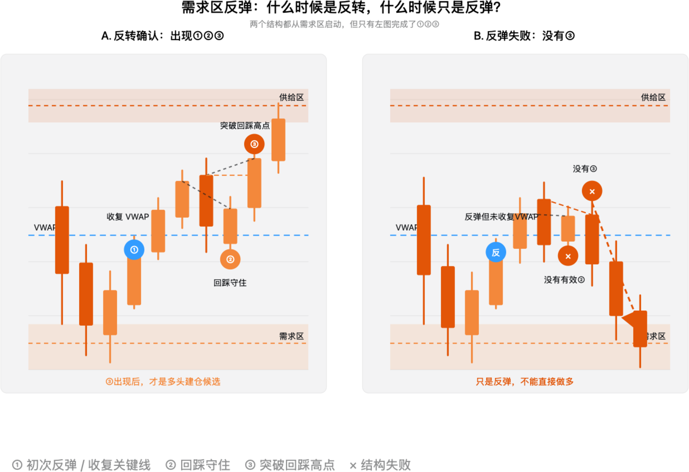
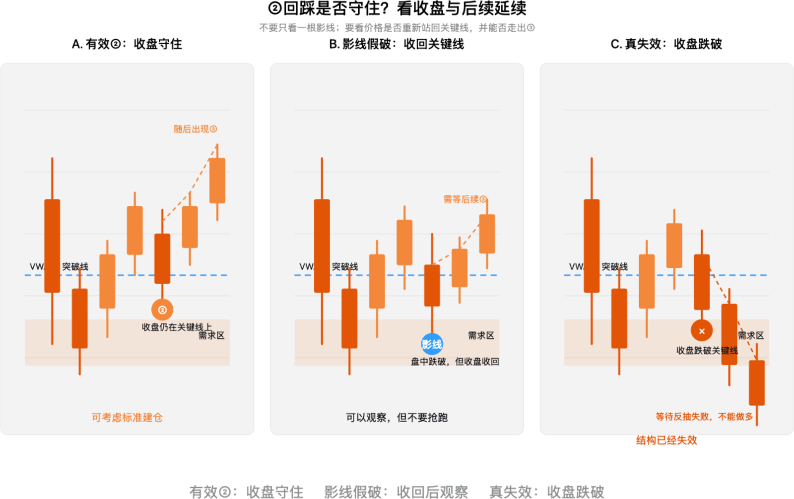
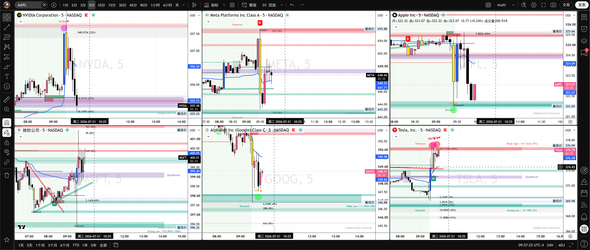

# 第八章：反弹、反转与回踩有效性

> 价格从需求区上涨，只能证明买盘出现；只有结构完成，才能进入建仓评估。

这一章把前面学过的需求区、VWAP、①②③和收线确认合并起来，解决一个最常见的问题：

> 价格已经从低位反弹了，我现在能不能做多？

## 一、反弹不等于反转

价格进入需求区后上涨，只能说明这里出现了买盘反应。它不能自动证明下跌趋势已经结束，也不能替代结构确认。

```text
反弹：价格从低位离开
反转：低点抬高 + 收复关键线/VWAP + 出现③ + 后续延续
```



*图 1：左图完成①②③，属于多头建仓候选；右图只是从需求区反弹，没有有效②和③，最后重新走弱。图中价格为构造示例。*

### 左图：反转确认

```text
需求区
→ ① 初次反弹并收复关键线
→ ② 回踩守住
→ ③ 突破回踩高点
→ 多头建仓候选
```

### 右图：反弹失败

```text
需求区
→ 反弹，但没有收复VWAP
→ 没有形成有效②
→ 没有③
→ 跌回需求区或继续下跌
```

因此，不能只因为出现绿色 K 线、Call Prem 上升，或者指标出现 `Pre Buy`，就把反弹当成反转。期权资金流只能辅助确认，不能推翻价格结构。

## 二、②回踩到底算不算守住

回踩不是“价格碰到一条线”这么简单。需要同时观察：

1. 回踩 K 线的收盘位置；
2. 价格是否重新被接受在旧区间内；
3. 回踩低点是否破坏结构；
4. 下一根 K 线能否沿原方向推进；
5. 后续是否有机会形成③。



*图 2：有效②看收盘与后续延续，不只看盘中影线。图中价格为构造示例。*

### A. 有效②：收盘守住

- 回踩到 VWAP、突破线或需求区；
- K 线收盘仍站在关键线上方；
- 回踩低点没有破坏结构；
- 后续突破回踩高点，形成③。

这是标准的多头确认结构。

### B. 影线假破：收回关键线

价格盘中短暂跌破关键线，但收盘重新站回。此时不能因为影线就立即判定失效，也不能马上抢跑，应等待后续③。

```text
盘中跌破
→ 收盘收回关键线
→ 观察下一根是否继续承接
→ 等待③
```

### C. 真正失效：收盘跌破

- K 线实体收盘跌破关键线；
- 下一根无法重新站回；
- 反弹高点降低；
- 价格继续向需求区下方扩张。

这时多头结构已经失效。不能因为“之前有需求区”就继续持有多单。

## 三、③仍然是明确的执行信号

本章的③仍然不是第三根 K 线，也不是某个指标名称，而是：

> 回踩守住以后，价格突破回踩过程中形成的小高点。

多头结构可以写成：

```text
① 突破或收复关键位
② 回踩关键位并守住
③ 突破回踩结构高点
```

空头结构完全对称：

```text
① 跌破关键位
② 反抽关键位但站不回去
③ 跌破反抽结构低点
```

如果只是从需求区反弹，却没有突破回踩高点，就不能称为完整反转。

## 四、这些 K 线一般是几分钟

示意图本身不固定周期，它表达的是结构关系，而不是某个特定时间长度。

对于 SPX 0DTE 日内交易，默认分工如下：

| 周期 | 主要任务 |
| --- | --- |
| 5 分钟 | 判断趋势、震荡、失败突破，标记主要供需区和关键位 |
| 1 分钟 | 执行①②③，寻找入场、失效点和时间退出 |
| 3 分钟 | 可选的过渡确认，用于过滤过于嘈杂的 1 分钟结构 |
| 15 分钟以上 | 观察更大的压力、支撑、前高和前低 |

最实用的组合是：

```text
5分钟：价格突破关键位
→ 1分钟：回踩守住
→ 1分钟：出现③
→ 1分钟收盘确认后建仓
```

例如 5 分钟突破 `7500`，1 分钟回踩到 `7500` 附近没有收盘跌破，随后 1 分钟突破回踩高点，这才是完整的多头候选。

如果 1 分钟出现③，但 5 分钟仍然明显处于供给区或下降结构中，信号应降级。可以等待 5 分钟收盘确认，或者直接放弃。

> 5 分钟决定“能不能做”，1 分钟决定“在哪里做”。

## 五、建仓与止损

学习阶段建议使用标准确认方式：

```text
②回踩守住
→ 等待③突破
→ 等待③的1分钟K收盘
→ 检查目标空间
→ 再建立仓位
```

### 建仓方式

- **标准方式**：③突破并收盘确认后建仓；
- **保守方式**：③后等待一次小幅二次回踩，再建立主要仓位；
- **激进方式**：②守住时提前试仓，但只能使用更小风险，暂不作为默认方法。

没有一种订单方式可以同时做到最低价格、完全确认和永不错过。限价单可能在影线刺穿时成交，随后价格立即跌回；等待收盘则可能成交更高或错过。因此学习阶段优先保护结构证据，而不是追求最低成本。

### 止损方式

多头止损通常放在：

- ②回踩形成的最低点下方；
- 或需求区下方；
- 或价格重新被接受在旧区间内的位置。

如果只是盘中影线跌破，但收盘收回，不应只因为影线本身就立刻止损。若实体收盘跌破，并且后续无法重新收回，则结构失效。

## 六、结合之前的六股票截图



*图 3：六只大型科技股的历史盘中截图，用于练习“位置—环境—结构—确认”的观察顺序，不是实时交易点位。*

### AAPL

AAPL 从约 `322` 附近需求区反弹，但上方约 `324.3—324.6` 附近仍有压力。正确的问题不是“它已经涨了，能不能追”，而是：

```text
是否收复上方关键压力？
回踩是否守住？
是否形成③？
```

### GOOGL

GOOGL 从约 `346.8—347` 附近需求区反弹，但仍需观察能否收复约 `349.58` 附近 VWAP。没有收复 VWAP 和形成③之前，属于反弹观察，不是明确多头。

### TSLA

TSLA 从低位需求区反弹较强，但靠近上方供给区时，强势本身不能成为追多理由。应等待突破前高后的回踩，或等待价格回到 VWAP/需求区后重新出现③。

### NVDA、META、MSFT

- NVDA：冲高回落后，先看需求区是否守住，再看能否重新收复关键线；
- META：若价格在平衡区和 VWAP 附近反复穿越，属于方向不清，等待边界；
- MSFT：即使相对稳定，也需要确认价格不在区间中间追单。

## 七、本章执行卡

```text
当前周期：5分钟环境 / 1分钟执行
价格位置：Demand / Equilibrium / Premium
关键线：VWAP、ORB、前高低或节点
是否完成①：
②回踩最低点：
②收盘是否守住：是 / 否
是否出现③：
结构失效：
第一目标：
目标空间是否足够：
```

## 本章总结

```text
需求区只提供观察位置
VWAP提供环境过滤
②证明回踩是否有效
③提供明确执行信号
后续延续验证交易是否得到市场接受
```

最重要的一句话：

> 影线可以容忍，收盘结构不能忽略；从需求区反弹，不等于已经反转。

> 本章用于交易教育和个人研究，不构成投资建议。图例为构造示例，不能直接视为实时买卖信号。
